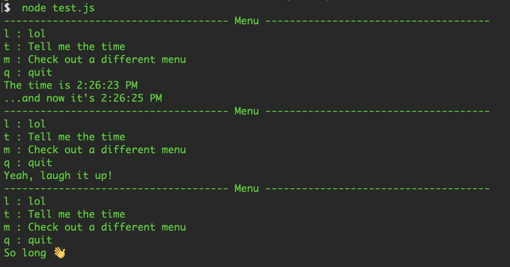

Organize your CLI app around menu selections.

This function displays a menu on the screen, waits for the user to type a key to make a selection, and then calls the function for the selected menu item.

## Example

```js
const menu = require(`./index.js`)

menu({
	menu_items: [{
		key: `l`,
		name: `lol`,
		action: () => console.log(`Yeah, laugh it up!`),
	}, {
		key: `t`,
		name: `Tell me the time`,
		action: async() => {
			console.log(`The time is`, new Date().toLocaleTimeString())
			await new Promise(resolve => setTimeout(resolve, 1500))
			console.log(`...and now it's`, new Date().toLocaleTimeString())
		},
	}, {
		key: `m`,
		name: `Check out a different menu`,
		action: () => menu({
			title: `BEHOLD THE SUBMENU`,
			menu_items: [{
				key: `j`,
				name: `Tell me a joke`,
				action: () => console.log(`This library has no eunuch testes`),
			}, {
				key: `b`,
				name: `Go back`,
				action: ({ back }) => back(),
			}],
		}),
	}, {
		key: `q`,
		name: `quit`,
		action: ({ back }) => back(),
	}],
}).then(() => {
	console.log(`👋`)
})
```



## API

The `menu` function takes an object with three properties.

```js
menu({ title = `Menu`, menu_items, display_menu = default_display_menu })
```

- `title`: A label to display above the menu items
- `menu_items`: an array of objects representing the menu items
	- `key`: a single-character string representing the key the user will press to select the item
	- `name`: the string to display for the menu item
	- `action`: the function to call when the user selects the menu item
- `display_menu`: optional function that will be called when the menu needs to be displayed

The `menu` function returns a promise that will resolve once the user backs out of the menu.

### `action({ back })`

The `action` function may return a promise.

Once the promise resolves, the menu will be displayed again.

`back` is a function.  If you call it, the menu promise will resolve after the action function finishes.

Whatever value the action function returns will be used as the resolve value for the `menu`'s promise.

### `display_menu({ title, menu_items })`

Defaults to:

```js
const menu_width = 80
const default_display_menu = ({ title, menu_items }) => {
	if (title.length <= menu_width - 4) {
		const title_with_spaces = ` ` + title + ` `
		const dashes_on_left = Math.floor((menu_width - title_with_spaces.length) / 2)
		const title_with_dashes_on_left = title_with_spaces.padStart(title_with_spaces.length + dashes_on_left, `-`)
		const display_title = title_with_dashes_on_left.padEnd(menu_width, `-`)
		console.log(display_title)
	} else {
		console.log(title)
	}
	menu_items.forEach(
		({ key, name }) => console.log(key, `:`, name),
	)
}
```

## License

[WTFPL](https://wtfpl2.com/)
